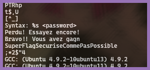

# Reverse - Facile

En utilisant une analyse des chaînes de caractères présentes dans le fichier, il a été possible d'extraire des informations sensibles, obtenant ainsi le mot de passe demandé par l'application.

Le binaire fourni dans le challenge contenait le **mot de passe en clair**, sans même avoir à le lancer. En affichant les chaînes de caractères contenues via la commande `strings crack`, il est possible d'avoir **accès aux messages d'erreur et de réussite**, ainsi qu'au **mot de passe**. Cependant, une exécution reste nécessaire pour confirmer sa validité.
___
### 1. Extraction des chaînes de caractères


Parmi les *chaînes extraites*, nous retrouvons cette valeur qui s'apparente à un mot de passe :
```
SuperFlagSecuriseCommePasPossible
```
___
### 2. Exécution avec le mot de passe extrait
Pour confirmer son authenticité, il faudra exécuter la commande suivante :
```
./crack SuperFlagSecuriseCommePasPossible
```
Le programme renvoie alors un **message de réussite**, confirmant que le mot de passe extrait est correct.