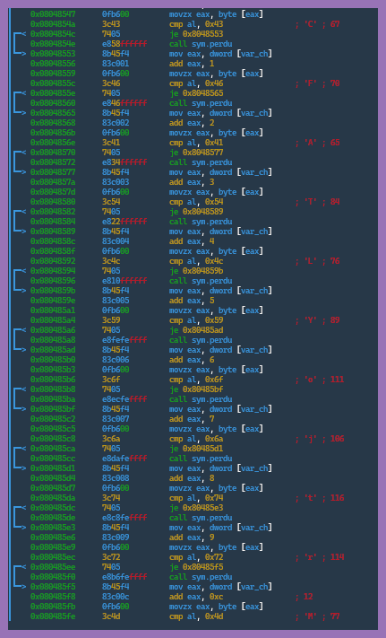

# Reverse - Pas difficile

En utilisant un outil de rétro-ingénierie, il a été possible de reconstituer des informations sensibles, obtenant ainsi le mot de passe attendu par le programme.

Le binaire fourni dans le challenge **compare** une entrée donnée avec des caractères inscrits en clair dans le code. En utilisant un **désassembleur**, ici *radare2* (r2), il est possible déterminer les **valeurs ASCII** attendues par l'application, permettant ainsi d'obtenir le **mot de passe**.
___
### Analyse et Désassemblage du Binaire
Avant d'accéder au code avec r2, il est nécessaire de réaliser une analyse du binaire.
```
aaa # Réalise une analyse intermédiaire 
```
Il faut ensuite identifier la fonction à désassembler. Pour cela, il faut lister les fonctions présentes dans le binaire.
```
afl
```
La fonction `main` ressort parmi les fonctions listées.

Il est alors possible de désassembler le binaire.
```
pdf @main
```

Voici une portions du code obtenue :  


Avec r2, les valeurs hexadécimales sont retranscrites à leur valeur ASCII sous forme de caractère dans les commentaires. Les positions des caractères attendus sont également indiqué. Le mot de passe peut être reconstitué en suivant l'ordre donné.
```
Flag => CFATLYojtrHuMRZIJkqx
```

Ce mot de passe, lorsqu'il est exécuté avec le programme, renvoie la sortie correspondante au message de réussite.
```
./encoreunflag CFATLYojtrHuMRZIJkqx
```